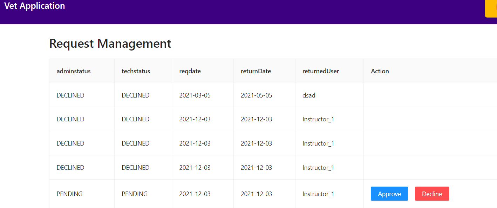

*ENSF 607 - Advanced Software Development and Architecture*

*Assignment 6 - Hachathon*

by Yuhua Guo, Pang-Cheng Chang, Jintao Wang

**Animal Request Management**

In this hackathon, you will develop the animal request management epic for the vet management system. The workflow is such that the instructor submits a request for an animal, then the admin and technician may approve or reject the request respectively. After approval from both the admin and the technician, the animal is ready to be delivered. 

You can assume that there are only 3 types of animals: dogs, cats, and horses, and there are only 8 animals available for each type. 

The application has three users as follows:

#Instructor

    1. Can request an animal 
    

    2. Can cancel a request
    

    3. Can view available animals
    

#Admin

    4. Can view new requests
    

    5. Can Approve a request
    

    6. Can reject a request
    

#Technician

    7. Can view new requests
    

    8. Can Approve a request
    

    9. Can reject a request
    

* Instructors can only cancel requests when their request is in "new" or "accepted_by_admin" states.
* The application must have a backend and frontend, and the API must connect the two.
* The application must be consistent when two users concurrently change a request state.
* Every team must commit partially every few hours.
* Each team must be based on final-project teams.
* Different roles login with these credentials:
    * Instructor_1: pass: pt@123
    * Admin_1: pass: pa
    * Technician: pass: pe

**Due date: Before 11:59 PM on Friday December 3rd**

Groups will present their final submission during the lecture on Tuesday, December 6th. Each presentation will be no longer than **5 minutes**. During this presentation, the teams must present the architecture, backend, and the frontend of their application. 

Note: All group members must be present (and active) during their presentations. All students must attend all presentations. 
